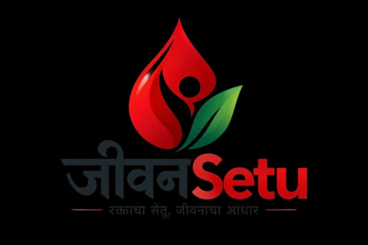
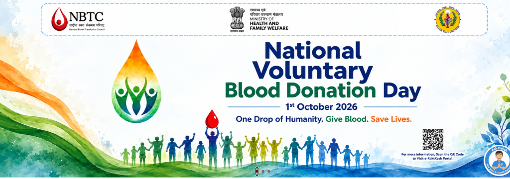
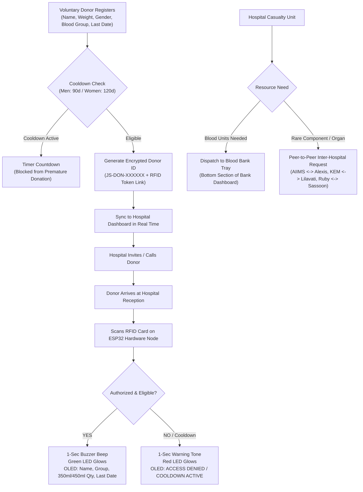
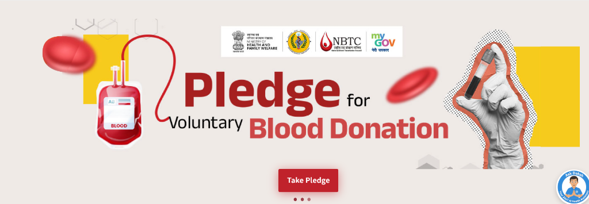

# जीवनSetu (JeevanSetu) — Action-First Blood & Organ Network

<div align="center">



### **रक्ताचा सेतू, जीवनाचा आधार**
**Intelligent Blood Logistics, Inter-Hospital Peer Sharing & IoT Hardware Verification Network**

[](https://vercel.com)
[](https://vitejs.dev)
[](https://reactjs.org)
[](https://www.typescriptlang.org)
[](https://platformio.org)
[](https://firebase.google.com)

</div>

---

<div align="center">
  
</div>

---

## 📌 Executive Overview

**JeevanSetu** is an action-first MedTech platform engineered to bridge the critical gap between voluntary blood/organ donors, hospital intensive care units (ICUs), and certified blood storage centers across **Nagpur, Mumbai, and Pune**. 

Unlike legacy search-first portals that rely on stale phone lists, JeevanSetu delivers:
1. **Real-Time Synchronized Dashboards**: Live data reactivity across Donors, Hospitals, and Blood Banks using Firebase Firestore.
2. **Strict Role-Based Isolation**: Donors, Hospitals, and Blood Banks are partitioned into dedicated, tamper-proof portals with cross-role login prevention.
3. **Biological Cooldown Safety**: Strict interval enforcement (3 months / 90 days for men; 4 months / 120 days for women) with automated countdown timers.
4. **Inter-Hospital Peer-to-Peer Network**: Direct transfer requests between hospitals for scarce blood components and transplant organs.
5. **Physical ESP32 IoT Hardware Station**: On-site hospital triage verification utilizing RC522 RFID, 128x64 OLED display, dual status LEDs, and a 1-second buzzer.

---

## 🏙️ Tri-City Regional Scope

JeevanSetu operates with native support for healthcare institutions in three major Maharashtra hubs:

| City Hub | Key Connected Hospitals | Blood Banks |
| :--- | :--- | :--- |
| **Nagpur** | AIIMS Nagpur Super Specialty, Alexis Multispecialty, GMC Nagpur, Wockhardt Hospital | Central Blood Bank, Metro Regional Blood Centre |
| **Mumbai** | KEM Hospital & Research Center, Lilavati Hospital, Kokilaben Hospital, Tata Memorial | Mumbai Life Blood Bank, Rotary Regional Center |
| **Pune** | Ruby Hall Clinic, Sassoon General Hospital, Sahyadri Super Specialty, Deenanath Mangeshkar | Pune City Voluntary Blood Bank, Red Cross Center |

---

## 🎨 MedTech Design System & UI/UX

Designed with high-grade healthcare standards:
- **MedTech Energetic Orange (`#EA580C`)**: Signals urgency, life-saving donation, and primary action.
- **Healthcare Healing Green (`#10B981`)**: Denotes clinical safety, verified donor badges, and eligibility.
- **Medical Trust Blue (`#0284C7`)**: Professional healthcare accent for hospital triage and technology indicators.
- **Theme Support**: Seamless **Light Mode** and **Dark Mode** toggle directly in the navigation bar.
- **Multi-Language Selector**: Native support for **English**, **हिंदी (Hindi)**, and **मराठी (Marathi)** positioned on the landing page hero banner.

---

## 🔄 End-to-End Workflow: How JeevanSetu Works



---

<div align="center">
  
</div>

---

## 🖥️ Role Portals & Core Features

### 1. Voluntary Donor Portal (`/donor`)
- **Post-Login Blood Donation Registration Form**:
  - Captures Full Legal Name, Age (18–65), Biological Gender, Body Weight ($\ge 50$ kg), Blood Group, City, Contact, Last Donation Date (or First-Time Donor), Medical History, Government Aadhaar ID, and Hardware RFID Card UID.
  - Generates an encrypted/masked **Unique Donor ID** (`JS-DON-XXXXXX`) bound to the RFID token.
- **Gender-Based Biological Cooldown**:
  - Automatically calculates interval eligibility: **3 months (90 days) for men**, **4 months (120 days) for women**.
  - Interactive SVG countdown gauge showing remaining recovery days and calculated eligible donation volume (**350 ml** for 50–60 kg; **450 ml** for $> 60$ kg).
- **Gamification & Rewards**:
  - Earns **+100 Lifesaver Points** on registration and points per donation.
  - Rank tiers: *Bronze Donor* (0–149 pts) $\rightarrow$ *Silver Guardian* (150–299 pts) $\rightarrow$ *Gold Lifesaver* (300–499 pts) $\rightarrow$ *Platinum Legend* (500+ pts).
  - Unlocked badge system (*First Pledge*, *Blood Hero*, *City Lifesaver*).
- **Downloadable & Printable Certificate**:
  - Official Certificate of Appreciation with donor credentials, tier badge, and one-click print/PDF download.
- **Medical Report Generation**:
  - Dedicated button in both the donor view and top navbar to generate a clinical donor health summary.

---

### 2. Hospital Clinical Dashboard (`/hospital`)
- **Live Donor Registrations Table**:
  - Every donor registration is instantly mirrored to the hospital dashboard in real time.
  - Displays donor name, blood group, city node, age, weight, biological eligibility status, eligible volume, last donation date, and RFID UID token.
  - Action button to send donor invitations for scheduled hospital arrival.
- **Inter-Hospital Peer-to-Peer Network**:
  - Direct hospital-to-hospital resource requisition across Nagpur, Mumbai, and Pune.
  - Request scarce blood components (*Whole Blood*, *PRBC*, *Platelets*, *Cryo*) or vital organs (*Kidney*, *Liver*, *Heart*, *Cornea*, *Lungs*).
  - Track triage transfer status (*Requested* $\rightarrow$ *Approved* $\rightarrow$ *Dispatched* $\rightarrow$ *Received*).
- **ESP32 Hardware Console & Simulator**:
  - On-screen hardware terminal showing live ESP32 status, dual LED indicators, 1-second audio buzzer tone, and SSD1306 128x64 OLED display output.

---

### 3. Blood Bank Facility Dashboard (`/bank`)
- **Smart Cold-Chain Inventory**:
  - Real-time stock counts by blood group with FEFO (First-Expired, First-Out) shelf dispatch.
  - Expiry warning system highlighting units with $\le 3$ days remaining.
  - Quarantine / Discard ledger recording cold-chain deviations with audit trails.
- **Hospital Emergency Request Tray (Bottom Section)**:
  - Real-time intake tray at the bottom of the dashboard listening for hospital casualty requests.
  - Instant **"Accept & Dispatch"** and **"Decline"** controls that update the hospital delivery status immediately.

---

## 🔒 Strict Role-Based Authentication & Isolation

To prevent cross-role session leaks, JeevanSetu implements strict dual-layer authorization:
1. **Login Validation**: If an account registered as a `Donor` attempts to log in through the `Hospital` or `Blood Bank` portal (or vice versa), the system rejects the session:
   > *"Access Denied: This account is registered as a Donor. You cannot log into the Hospital portal with these credentials. Please switch to the Donor login."*
2. **Route Guards**: [`ProtectedRoute.tsx`](./src/components/ProtectedRoute.tsx) intercepts all URL navigation. If an unauthorized role enters a protected path, an access restriction banner is shown with a one-click redirect to their dedicated portal.

---

## ⚡ IoT Hardware Verification System (ESP32)

<div align="center">

| Component | Pin | ESP32 GPIO | Description |
| :--- | :--- | :--- | :--- |
| **RC522 RFID** | SDA / SS | **GPIO 5** | SPI Chip Select |
| **RC522 RFID** | SCK | **GPIO 18** | SPI Clock |
| **RC522 RFID** | MOSI | **GPIO 23** | SPI Master Out |
| **RC522 RFID** | MISO | **GPIO 19** | SPI Master In |
| **RC522 RFID** | RST | **GPIO 27** | Reset |
| **RC522 RFID** | 3.3V & GND | **3.3V / GND** | Power & Ground |
| **SSD1306 OLED** | SDA | **GPIO 21** | I2C Data (Auto-detected 0x3C / 0x3D) |
| **SSD1306 OLED** | SCL | **GPIO 22** | I2C Clock (100 kHz Standard Mode) |
| **SSD1306 OLED** | VCC & GND | **3.3V / GND** | Power & Ground |
| **Green LED** | Anode (+) | **GPIO 25** | Active HIGH via 220Ω resistor (Success) |
| **Red LED** | Anode (+) | **GPIO 26** | Active HIGH via 220Ω resistor (Denied / Cooldown) |
| **Buzzer** | Positive (+) | **GPIO 32** | 1-Second Audio Tone (Active/Passive Compatible) |
| **Onboard LED** | Anode (+) | **GPIO 2** | Power & Execution Status (Blue LED) |

</div>

### Hardware Logic:
1. **Power-On Self-Test**: On boot, Green LED flashes, Red LED flashes, Buzzer sounds a 150ms test chirp, and Onboard Blue LED turns ON.
2. **Card Scanned**: RC522 reads UID (e.g. `A4:8B:2F:10`).
3. **If Authorized & Eligible**:
   - **Buzzer beeps for exactly 1 second** (1000ms).
   - **Green LED turns ON** for 4 seconds (Red LED stays OFF).
   - **OLED Displays**:
     ```
     +-------------------------+
     |     VERIFIED DONOR      |
     |-------------------------|
     | Name: Rahul Sharma      |
     | Blood: O+ (Male)        |
     | Eligible: 450 ml        |
     | Last: 12 July 2026      |
     +-------------------------+
     ```
4. **If Unauthorized or In Cooldown**:
   - **Buzzer beeps 1-second warning tone**.
   - **Red LED turns ON** for 3 seconds (Green LED stays OFF).
   - **OLED Displays**: `ACCESS DENIED / NOT REGISTERED` or `COOLDOWN ACTIVE` (with remaining days).

---

## 🚀 Vercel Deployment Guide

JeevanSetu is configured for zero-configuration, production-grade deployment on **Vercel**.

### Step 1: Push Code to GitHub
Ensure the latest code is on branch `main`:
```powershell
.\commit_and_push_frontend.ps1 -CommitMessage "deploy: prepare production build for Vercel"
```

### Step 2: Import into Vercel
1. Go to [Vercel Dashboard](https://vercel.com/dashboard) and click **"Add New Project"**.
2. Select your repository: `Manaspingle/JeevanSetu_StrawHats`.
3. Vercel automatically detects the Vite configuration:
   - **Framework Preset**: `Vite`
   - **Build Command**: `npm run build`
   - **Output Directory**: `dist`
   - **Install Command**: `npm install`
4. Click **Deploy**.

### Step 3: SPA Rewrites
[`vercel.json`](./vercel.json) is pre-configured with SPA route rewrites:
```json
{
  "framework": "vite",
  "buildCommand": "npm run build",
  "outputDirectory": "dist",
  "rewrites": [
    {
      "source": "/(.*)",
      "destination": "/index.html"
    }
  ]
}
```
Direct URLs such as `/donor`, `/hospital`, and `/bank` will resolve seamlessly without 404 errors on browser refresh.

---

## 🛠️ Local Development & PlatformIO Firmware Flashing

### Web Application:
```bash
# 1. Clone repository
git clone https://github.com/Manaspingle/JeevanSetu_StrawHats.git
cd JeevanSetu_StrawHats

# 2. Install dependencies
npm install

# 3. Start local development server
npm run dev

# 4. Compile production build
npm run build
```

### ESP32 PlatformIO Firmware:
```bash
# 1. Compile firmware
pio run

# 2. Flash to ESP32 board (configured on COM11)
pio run --target upload

# 3. Open serial monitor
pio device monitor -b 115200
```

---

## 📦 Project Directory Structure

```text
JeevanSetu/
├── hardware/                     # PlatformIO ESP32 Embedded System
│   ├── platformio.ini            # Board: esp32dev, libraries: MFRC522, SSD1306, GFX
│   ├── src/
│   │   └── main.cpp              # Full C++ firmware with 1s buzzer, dual LEDs, OLED scanner
│   └── README.md                 # Hardware wiring and build guide
├── public/                       # Static branding and logo assets
│   ├── jeevansetu-logo.png       # Official JeevanSetu insignia
│   ├── celebration-banner.png    # Community donation banner
│   └── pledge-banner.png         # Lifesaver pledge banner
├── src/
│   ├── components/               # Reusable UI components
│   │   ├── Navbar.tsx            # MedTech responsive navbar with Light/Dark toggle
│   │   ├── ProtectedRoute.tsx    # Role isolation barrier
│   │   └── ui/                   # Status badges, modal dialogs, toast alerts
│   ├── context/
│   │   ├── AuthContext.tsx       # Cross-role login prevention & session manager
│   │   ├── ThemeContext.tsx      # Light/Dark theme provider with Tailwind class sync
│   │   └── LanguageContext.tsx   # English / Hindi / Marathi i18n
│   ├── pages/
│   │   ├── LandingPage.tsx       # Hero, language dropdown, interactive workflow steps
│   │   ├── AuthPage.tsx          # Login & registration forms for Donors, Hospitals, Banks
│   │   ├── DonorDashboard.tsx    # Registration form, cooldown ring, gamification, certificates
│   │   ├── HospitalDashboard.tsx # Donor registrations table, peer P2P requests, RFID console
│   │   └── BankDashboard.tsx     # Cold-chain vault, FEFO tracking, hospital request tray
│   ├── services/
│   │   └── bloodService.ts       # Central real-time data coordinator & state engine
│   └── styles/
│       └── tokens.css            # MedTech Orange, Green, and Blue CSS variables
├── commit_and_push_frontend.ps1  # Automated Git deployment script
├── platformio.ini                # Root PlatformIO pointer for VS Code extension
├── vercel.json                   # Vercel SPA deployment rules
└── package.json                  # Dependencies: React 18, Vite 7, Tailwind 3, Lucide
```

---

## 🤝 Contributing & License

Developed with passion by **StrawHats** for hackathon and societal healthcare impact. Distributed under the MIT License.

For inquiries or regional hospital onboarding in Maharashtra:
- **Hotline**: 108 / 104 (National Health Mission)
- **Central Portal**: [https://github.com/Manaspingle/JeevanSetu_StrawHats.git](https://github.com/Manaspingle/JeevanSetu_StrawHats.git)
